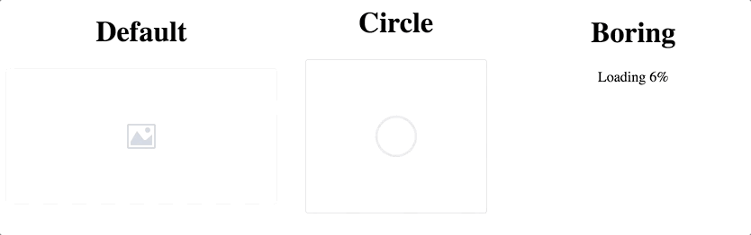

# react-progressive-img [](https://travis-ci.org/zzarcon/react-progressive-img)
> Progressive image rendering made easy

# Demo
[https://zzarcon.github.io/react-progressive-img](https://zzarcon.github.io/react-progressive-img)
<p align="center">
  
</p>
# Install

```
$ yarn add react-progressive-img
```

# Usage 

**default**

```javascript
import ProgressiveImg from 'react-progressive-img';

<ProgressiveImg
  src="https://your-site/some-image.png" 
/>
```

**all props**

```javascript
import ProgressiveImg from 'react-progressive-img';

<ProgressiveImg
  src="https://your-site/some-image.png"
  dimensions={{width: '100%', height: 150}}
/>
```

**render props**

```javascript
import ProgressiveImg from 'react-progressive-img';

<ProgressiveImg src="https://your-site/some-image.png" >
  {(state, percentage, src) => {
    if (state === 'error') {
      return <div>Error</div>;
    } else if (state === 'complete') {
      return ;
    } else {
      return <div>Loading {percentage}%</div>;
    }
  }}
```